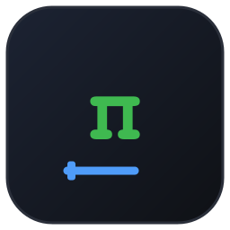
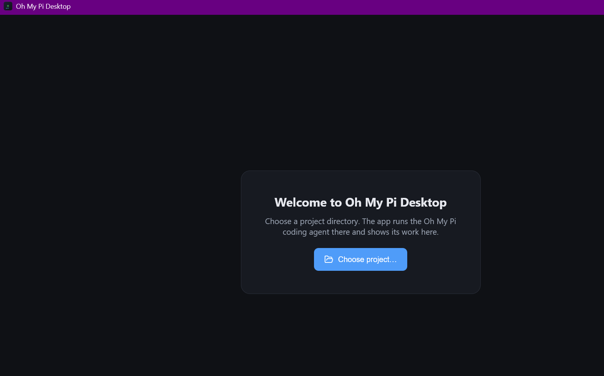

<div align="center">



# Oh My Pi Desktop

**A desktop chat client for the Oh My Pi coding agent.**

The `omp` agent ships with a terminal TUI and an RPC mode. This is the GUI —
an Electron app that drives `omp --mode rpc` as a child process and renders the
whole conversation: streaming markdown, tool-call cards, todos, and sessions.

[](https://oh-my-pi-desktop.pulse-core.com)
[](LICENSE)
[](package.json)
[](#requirements)
[](package.json)
[](package.json)

### [🌐 oh-my-pi-desktop.pulse-core.com](https://oh-my-pi-desktop.pulse-core.com)

[Requirements](#requirements) · [Install](#install) · [Features](#features) · [Architecture](#architecture) · [Protocol](#protocol-notes) · [Development](#development)



</div>

---

## Why

`omp` is a capable coding agent, but its only interface is an interactive
terminal TUI. That's a poor fit for reading long transcripts, scanning tool
calls, or keeping several projects' sessions straight.

The harness already exposes a clean integration surface — **RPC mode**, a
newline-delimited JSON protocol over stdio, framed and id-correlated with a v2
lossless chunking transport. This app is a client for it. It is not a terminal
wrapper: there is no PTY, no ANSI parsing, no screen scraping.

> **It never touches your credentials.** Auth stays in `omp`'s own store at
> `~/.omp/agent`. The app spawns a process and speaks a protocol to it, nothing
> more.

---

## Requirements

- **Windows 10/11**
- **`omp` on your PATH**, or installed at `~/.bun/bin/omp.exe`
- **Node 22+ and npm** — for development only, not for running the installer

---

## Install

Grab the installer from [Releases](https://github.com/dylansantwani/oh-my-pi-desktop/releases),
or build it yourself:

```bash
npm install
npm run dist
```

That produces `dist/Oh My Pi Desktop Setup 0.1.0.exe` (a per-user NSIS
installer) plus an unpacked portable folder at `dist/win-unpacked/`.

> ⚠️ **The installer is unsigned in v1.** Windows SmartScreen will warn on first
> run — "More info" → "Run anyway". Code signing is a v2 item.

---

## Features

| | |
|---|---|
| 💬 **Streaming chat** | Assistant output rendered as GFM markdown with syntax-highlighted code blocks and copy buttons. Deltas are batched through `requestAnimationFrame` so a fast stream doesn't jank the UI. |
| 🔧 **Tool-call cards** | Every `tool_execution_*` event becomes an inline card: tool name, status, collapsible pretty-printed arguments, and the result or error excerpt. |
| 📁 **Sessions per project** | Pick a project directory; the app groups sessions by the `cwd` in each session file's header. New, resume, rename, and export to HTML. |
| 📜 **Incremental history** | Most recent page first, then "load older" via `get_messages_page` cursors — no monolithic history fetch. |
| 🎛 **Mid-turn control** | Abort, steer with an interrupting message, or queue a follow-up for after the turn. Model picker, thinking level, and fast mode toggle. |
| ✅ **Todo panel** | `todo_reminder` events drive a collapsible phase/task panel with status chips. |
| 🪟 **Agent dialogs** | `extension_ui_request` (confirm / select / input / editor / notify) renders as real modals and posts answers back. |
| ♻️ **Survives crashes** | If the agent dies, a banner appears and the process restarts on the same project and session, with history replayed. The transcript is not lost. |

### Not in v1

No embedded terminal, file explorer, diff viewer, or git panel. No concurrent
multi-session streaming — `omp` RPC hosts one active session per process, so
navigation is switch-then-view. No macOS or Linux builds. No auto-updater.

---

## Architecture

```
┌─────────────────────────────────────────────────────────┐
│ Renderer (React + Vite, Chromium)                       │
│  Chat transcript · tool-call cards · todos · sessions   │
│  composer · modals · status bar                         │
└───────────────▲─────────────────────────────────────────┘
                │ contextBridge IPC (window.omp, typed)
┌───────────────┴─────────────────────────────────────────┐
│ Electron main (Node)                                    │
│  RPC client (JSONL framing, id correlation, v2 chunks)  │
│  omp process lifecycle · session store · window mgmt    │
└───────────────▲─────────────────────────────────────────┘
                │ stdin/stdout JSONL
┌───────────────┴─────────────────────────────────────────┐
│ omp --mode rpc [--cwd <project>]  (child process)       │
└─────────────────────────────────────────────────────────┘
```

Three layers, one responsibility each:

1. **`omp` child process** — the agent. Owns all agent logic, session files,
   tools, and model calls.
2. **Electron main** — owns the child process and the protocol. No agent policy
   decisions live here.
3. **Renderer** — a pure projection of events. No agent logic, no filesystem
   access, no Node. `nodeIntegration` is off; everything crosses via
   `contextBridge`.

Source layout:

```
src/main/       agent-host.ts (process lifecycle + reconnect)
                rpc-client.ts (JSONL protocol, v2 chunking, id correlation)
                session-scanner.ts (session listing), ipc.ts
src/preload/    typed window.omp contextBridge API
src/renderer/   React UI — chat, tool cards, todos, sessions, dialogs
site/           source of oh-my-pi-desktop.pulse-core.com (static, no build step)
```

---

## Protocol notes

- **Spawn:** `omp --mode rpc --cwd <project>` with `PI_RPC_EMIT_TITLE=1`.
- **Sessions:** `~/.omp/agent/sessions/<bucket>/<timestamp>_<sessionId>.jsonl`.
  Headers carry `cwd`, which is how the app groups sessions per project.
- **Completion:** `prompt` and `abort_and_prompt` are acknowledged immediately.
  A turn is done on `agent_end`, `prompt_result`, or `data.agentInvoked: false`
  — not on the ack.
- **Recovery:** malformed JSONL is logged and skipped rather than fatal; the
  protocol is designed to be recoverable. Stale or session-busy page cursors
  discard the partial page and refetch from the session head.

### Failure handling

| Failure | Behavior |
|---|---|
| `omp` binary not found | Onboarding screen: PATH detection, manual path input, retry |
| Agent process crash | Banner + auto-restart on the same project and session; history replayed |
| RPC `success: false` | Inline toast with the error and code — never silent |
| Malformed JSONL | Log, skip the frame, continue |
| Frame over the v1 ceiling | Negotiated v2 chunking reassembles it |
| `omp` stdin closed | Treated as shutdown; restarts on the next user action |

---

## Development

```bash
npm install
npm run dev          # electron-vite dev server + app window
npm test             # unit tests (protocol against a mock omp + jsdom component tests)
RUN_E2E=1 npm test   # + integration tests against the real omp
npm run gen:icon     # regenerate the icon set from the 512px source
```

`RUN_E2E=1` needs a configured provider, since it drives the real agent.

The unit tests use a mock `omp`: a Node script that emits canned JSONL — ready
frame, v2 negotiation, response correlation, streaming deltas, tool events, and
a chunked v2 frame. That covers the protocol without needing a model.

| Doc | What it is for |
|---|---|
| [docs/superpowers/specs/](docs/superpowers/specs/) | The approved design — goals, non-goals, architecture, error table |
| [docs/superpowers/plans/](docs/superpowers/plans/) | Full implementation plan, milestone by milestone |

---

## License

MIT — see [LICENSE](LICENSE).

<div align="center">
<br>

**[oh-my-pi-desktop.pulse-core.com](https://oh-my-pi-desktop.pulse-core.com)**

</div>
